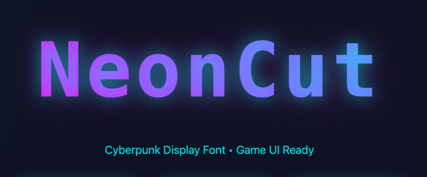

# ⚡ NeonCut Font

A bold cyberpunk display font with sharp angular letterforms. Perfect for gaming UI, tech brands, and futuristic designs.



[**→ View Live Demo**](https://johnfacey.github.io/neoncut-font/)

## ✨ Features

- **Sharp Geometric Design** - Angular letterforms with clean, precise cuts
- **Complete Character Set** - Uppercase, lowercase, numbers, and punctuation
- **Web Optimized** - WOFF2 and WOFF formats for fast loading
- **Cyberpunk Aesthetic** - Perfect for gaming, tech, and sci-fi projects
- **Free to Use** - Personal and commercial projects welcome

## 📦 Download

- [WOFF2 Format](fonts/neoncut.woff2) - Best for modern browsers
- [WOFF Format](fonts/neoncut.woff) - Legacy browser support
- [SVG Source](fonts/neoncut.svg) - Original vector format

## 🚀 Quick Start

### CSS Usage

```css
@font-face {
    font-family: 'NeonCut';
    src: url('fonts/neoncut.woff2') format('woff2'),
         url('fonts/neoncut.woff') format('woff');
    font-weight: normal;
    font-style: normal;
}

h1 {
    font-family: 'NeonCut', sans-serif;
    color: #00ffff;
}
```

### HTML

```html
<link rel="preload" href="fonts/neoncut.woff2" as="font" type="font/woff2" crossorigin>

<h1 style="font-family: 'NeonCut', sans-serif;">Your Text Here</h1>
```

## 🎨 Best Use Cases

- **Gaming UI** - Menus, HUDs, title screens
- **Esports Branding** - Team logos, stream overlays
- **Tech Startups** - Landing pages, app interfaces
- **Sci-Fi Projects** - Movie titles, book covers
- **Music & Entertainment** - Album covers, posters
- **Cyberpunk Themes** - Anything neon and futuristic

## 📋 Character Set

### Uppercase
`A B C D E F G H I J K L M N O P Q R S T U V W X Y Z`

### Lowercase
`a b c d e f g h i j k l m n o p q r s t u v w x y z`

### Numbers
`0 1 2 3 4 5 6 7 8 9`

### Punctuation
`! ? . , : ; - / ( ) ' "`

## 💡 Design Tips

- **Size**: Works best at 24px and above for readability
- **Color**: Pairs perfectly with cyan (#00ffff) and magenta (#ff00ff)
- **Background**: Dark backgrounds enhance the cyberpunk aesthetic
- **Spacing**: Add letter-spacing for even more impact
- **Effects**: Consider adding text-shadow or glow effects

```css
.neoncut-text {
    font-family: 'NeonCut', sans-serif;
    font-size: 48px;
    color: #00ffff;
    letter-spacing: 0.05em;
    text-shadow: 0 0 20px rgba(0, 255, 255, 0.5);
}
```

## 🌐 Browser Support

- Chrome/Edge (v36+)
- Firefox (v39+)
- Safari (v10+)
- Opera (v23+)
- iOS Safari (v10+)
- Android Browser (v4.4+)

## 📄 License

**Free for Personal and Commercial Use**

You are free to use Voltage Font in any project, including:
- ✅ Personal projects
- ✅ Commercial projects
- ✅ Client work
- ✅ Web and print designs
- ✅ Logos and branding

**Attribution appreciated but not required!**

## 🛠️ Technical Details

- **Format**: OpenType (WOFF2, WOFF, SVG)
- **Style**: Display, Sans-serif
- **Weight**: Regular (400)
- **Units per em**: 1000
- **Ascent**: 800
- **Descent**: -200

## 🤝 Contributing

Found a bug or have a suggestion? Feel free to:
- [Open an issue](https://github.com/johnfacey/neoncut-font/issues)
- Submit a pull request
- Share your projects using Voltage!

## 🎯 Inspiration

Voltage was inspired by:
- Neon-lit cyberpunk cityscapes
- Retro-futuristic arcade games
- Digital interface design
- Geometric brutalism

## 📸 Showcase

Using Voltage in your project? We'd love to see it! Tag us or open an issue to be featured.

## 📞 Contact

- **GitHub**: [@johnfacey](https://github.com/johnfacey)
- **Website**: [johnfacey.dev](https://johnfacey.dev)
- **X**: [@johnfacey](https://x.com/johnfacey)
- **BlueSky**: [@johnfacey](https://bsky.app/profile/johnfacey.bsky.social)

---

Made with ⚡ by [Your Name]

**[Download](fonts/neoncut.woff2)** • **[Demo](https://johnfacey.github.io/neoncut-font/)** • **[Report Issue](https://github.com/johnfacey/neoncut-font/issues)**
